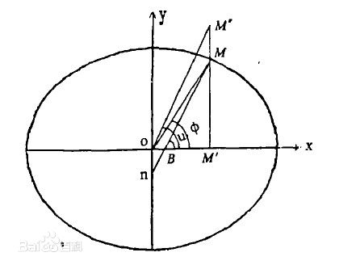

# 地球坐标系和地球椭球
## 定义
**子午圈（经圈）**：过旋转轴的平面（子午面）与椭球面的交线椭圆。
**平行圈（纬圈）**：正交于旋转轴的平面与椭球面的交线圆。
**赤道圈**：最大的平行圈，其所在的平面（赤道面）过椭圆中心。
**Frenet(伏雷内)标架**：利用曲线上任一点处的三个单位正交基构成的三维直角坐标系。其中T轴指向曲线的切线方向，n轴指向曲线的主法线方向，b轴指向曲线的副法线方向。
（主法线n：切向量的导数；副法线b：与切线和主法线垂直且符合右手法则的向量$\vec{b}=\vec{T}\times \vec{n}$。）
**大地经度L**：是指通过地面A点和地球椭球体旋转轴的平面与起始大地子午面（本初子午面）间的夹角L。
**大地纬度B**：椭球面在该点处的法线与赤道面的夹角。
**归化纬度u**：该点所在的子午面上的椭圆的对应的外接圆的圆心角
**球心纬度Φ（地心纬度）**：该点与椭球球心的连线与赤道面的夹角

## 旋转椭球面数学表达式
###直角坐标方程
$$ \frac{X^2}{a^2}+\frac{Y^2}{a^2}+\frac{Z^2}{b^2}=1 $$
(由两个独立参数唯一确定)
离心率(第一偏心率）和扁率：
$$ e=c/a=\frac{\sqrt{a^2-b^2}}{a} \qquad \alpha=\frac{a-b}{a} $$
起始子午线的方程：
$$ \frac{X^2}{a^2}+\frac{Z^2}{b^2}=1,\quad Y=0 $$
经度为L的经线的方程：
$$ 
\frac{X^2}{a^2}+\frac{Y^2}{a^2}+\frac{Z^2}{b^2}=1,\quad \frac{Y}{X}=\tan L
$$
### 参数方程
####1. 以大地经度L及归化纬度u为参数

起始子午面参数方程：
$$
X_0=a\cos u,\quad Y_0=0,\quad Z_0=b\sin u \qquad (A)
$$
绕Z轴旋转即得参数椭球面参数方程：
$$ \left\{
\begin{aligned}
&X=a\cos u\cos L\\
&Y=a\cos u\sin L\\
&Z=b\sin u
\end{aligned}
\right.
$$
####2. 以大地经度L及大地纬度B为参数
起始子午线方程：
$$ \frac{X^2}{a^2}+\frac{Z^2}{b^2}=1 \qquad (1)$$
在M点处的法向量：
$$ (\frac{2X}{a^2},\frac{2Z}{b^2})$$
根据B的定义有：
$$\tan B=\frac{2Z}{b^2}/\frac{2X}{a^2} $$
即：
$$Z=X(1-e^2)\tan B \qquad (2)$$
联立（1）（2）有：
$$
\left\{
    \begin{aligned}
    &X=\frac{a\cos B}{\sqrt{1-e^2\sin^2 B}} \\
    &Z=\frac{a(1-e^2)\sin B}{\sqrt{1-e^2\sin^2 B}}
    \end{aligned}
\right. \qquad (B)
$$
令$W=\sqrt{1-e^2\sin^2 B},\quad N=\frac{a}{W} $
绕Z轴旋转有：
$$
\left\{
    \begin{aligned}
    &X=N\cos B\cos L \\
    &Y=N\cos B\sin L \\
    &Z=N(1-e^2)\sin B 
    \end{aligned} \qquad (3)
\right.
$$
####3. 以大地经度及球心纬度为参数
起始子午线方程：
$$ \frac{X^2}{a^2}+\frac{Z^2}{b^2}=1 $$
椭圆的圆心极坐标方程：
$$ \rho=a\sqrt{\frac{1-e^2}{1-e^2\cos^2 \Phi}} $$
由关系式
$$
    X=\rho\cos \Phi,\quad Z=\rho\sin \Phi
$$
得
$$
X=a\cos\Phi\sqrt{\frac{1-e^2}{1-e^2\cos^2 \Phi}},\quad
Z=a\sin\Phi\sqrt{\frac{1-e^2}{1-e^2\cos^2 \Phi}} \qquad(C)
$$
绕Z轴旋转有：
$$
\left\{
    \begin{aligned}
    &X=a\cos\Phi\cos L\sqrt{\frac{1-e^2}{1-e^2\cos^2 \Phi}} \\
    &X=a\cos\Phi\sin L\sqrt{\frac{1-e^2}{1-e^2\cos^2 \Phi}} \\
    &Z=a\sin\Phi\sqrt{\frac{1-e^2}{1-e^2\cos^2 \Phi}} 
    \end{aligned}
\right.
$$
比较（A)(B)(C)有：
$$
\begin{aligned}
   \tan u &=\sqrt{1-e^2}\tan B \\
   \tan \Phi &=(1-e^2)\tan B
\end{aligned}
$$
###旋转椭球面的几何性质
1. 对称性
有三个对称面，一个对称中心
2. 有界性
$$
|X| \le a,\quad |Y|\le a,\quad |Z|\le b
$$
3. 正则性（法向量不为0）
椭圆$ \frac{X^2}{a^2}+\frac{Y^2}{a^2}+\frac{Z^2}{b^2}=1 $的法向量：
$$ (\frac{2X}{a^2},\frac{2Y}{a^2},\frac{2Z}{b^2})$$
将（3）式带入并单位化得：
$$ \vec{n}=(\cos B\cos L,\cos B\sin L,\sin B)$$
4. 不可展性
旋转椭球面为不可展曲面
##法截线的曲率及曲率半径

