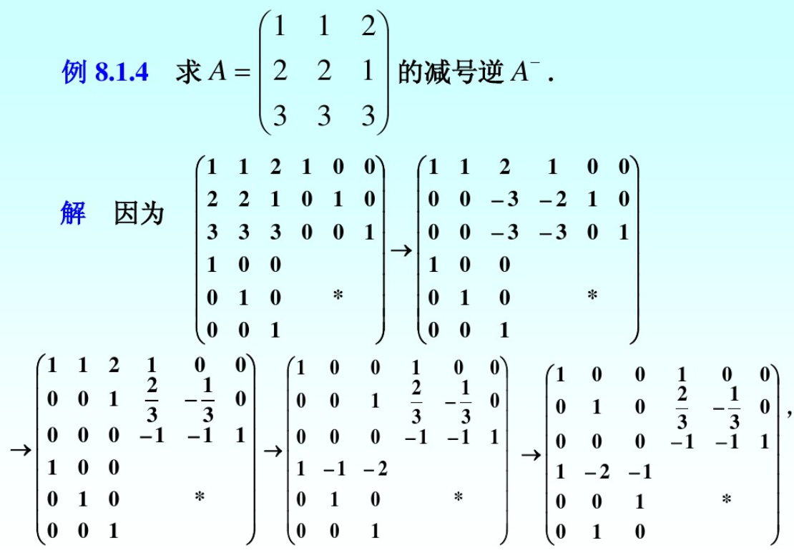
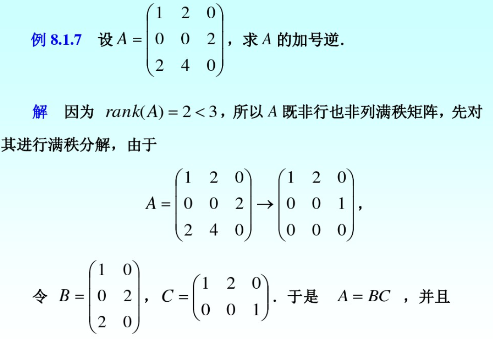
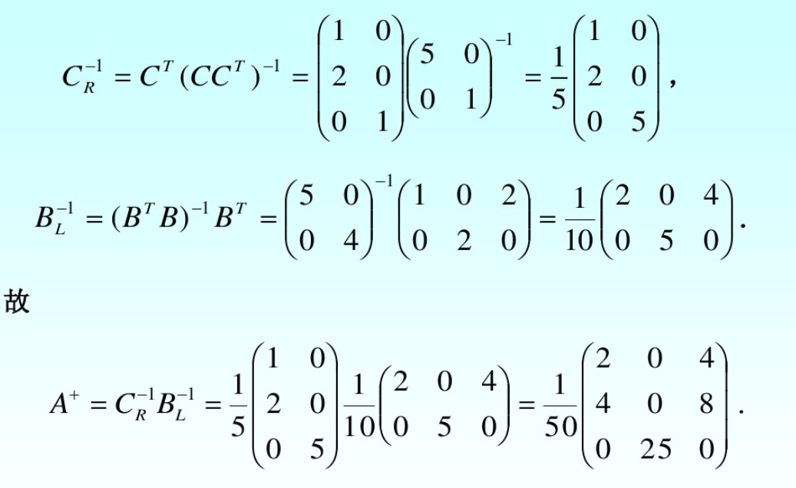
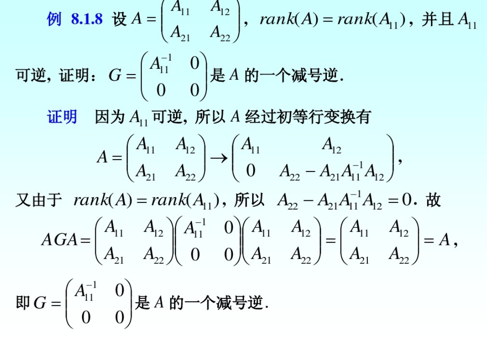
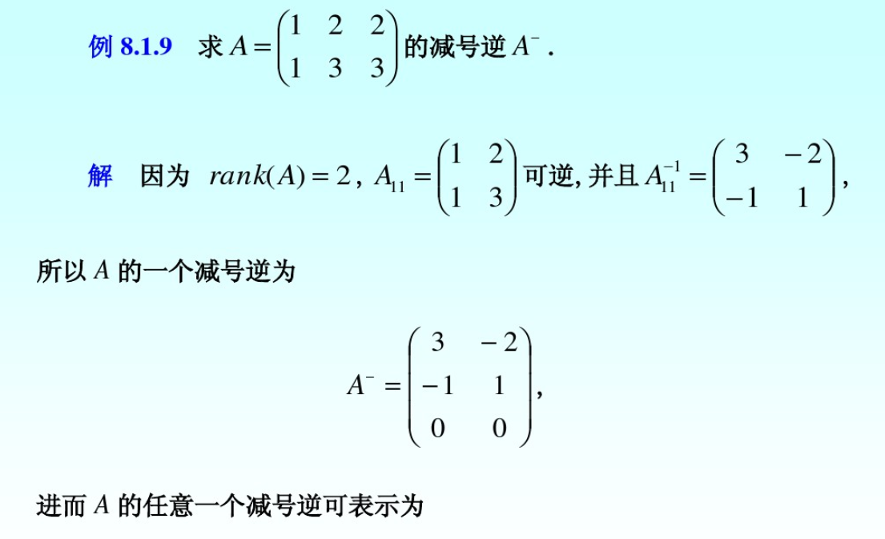
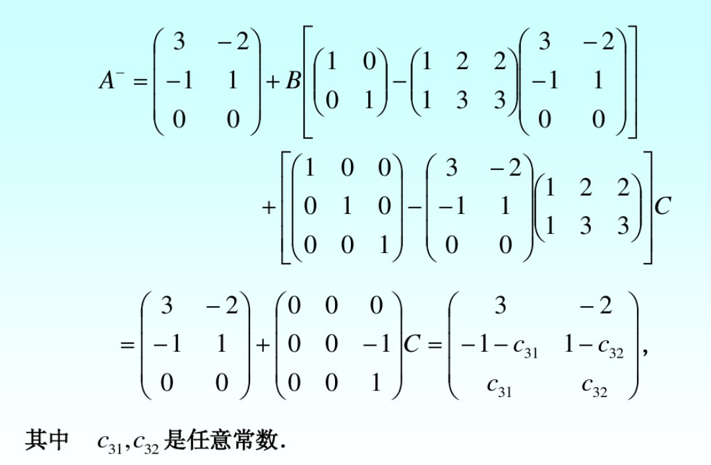
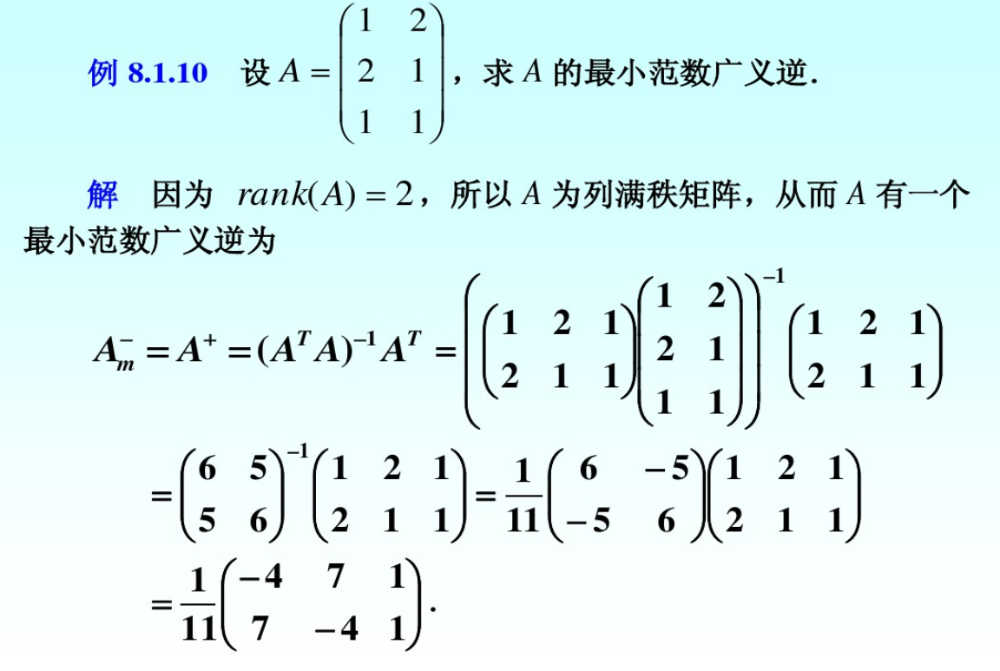
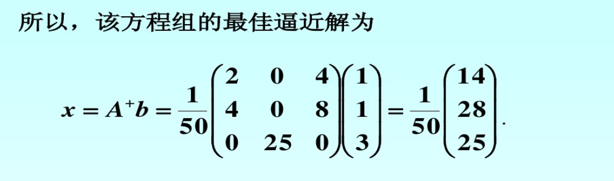

# 矩阵的逆与广义逆

## 逆

有下列等价说法：
矩阵非奇异--矩阵可逆--矩阵的行列式不等于0--矩阵满秩--齐次方程只有0解

（矩阵求逆引理，Sherman-Morrison公式）令A是一个n阶可逆方阵，并且x、y是两个n维列向量，使得$(A+xy')$可逆，则
$$(A+xy')^{-1}=A^{-1}-\frac{A^{-1}xy'A^{-1}}{1+y'A^{-1}x}$$

推广为矩阵之和求逆公式(Woodbury公式)：
$$(A+UBV)^{-1}=A^{-1}-A^{-1}U(I+BVA^{-1}U)^{-1}BVA^{-1} $$
特别地，当$U=u,B=b,V=v'$时,有：
$$(A+buv')^{-1}=A^{-1}-\frac{b}{1+bv'A^{-1}u}A^{-1}uv'A^{-1}$$

还有Duncan-Guttman求逆公式：
$$(A-UD^{-1}V)^{-1}=A^{-1}+A^{-1}U(D-VA^{-1}U)^{-1}VA^{-1} $$

经典应用
令$J_n$是一个n阶全一方阵，由于n阶方阵
$$
V=\begin{bmatrix}
a & b & \ldots & b\\
b & a & \ldots & b\\
\vdots & \vdots & \ddots & \vdots\\
b & b & \ldots & a
\end{bmatrix}=(a-b)I_n+bJ_n=(a-b)(I_n+\frac{b}{a-b}J_n)
$$ $$
V^{-1}=\frac{1}{a-b}(I_n+\frac{b}{a-b}J_n)^{-1}=\frac{1}{a-b}\left[I_n-\frac{b}{a+(n-1)b}J_n\right]
$$

## 广义逆

### 单边广义逆

左逆矩阵：满足LA=I的矩阵L，记为$A_L^{-1}$
右逆矩阵：满足AR=I的矩阵R，记为$A_R^{-1}$

不难证明：$A_R^{-1},A_L^{-1} $同时存在$\iff A^{-1}$存在，此时有$A^{-1}=A_R^{-1}=A_L^{-1}$

然而，$A\in C^{m\times m}$可能既有左逆又有右逆。左逆右逆往往非唯一。

从向量空间的角度看，线性方程$Ax=y$有解等价于向量y是矩阵A的n个列向量的线性组合。即
$$span(a_1,\cdots,a_n,y)=span(a_1,a_2,\cdots,a_n)$$
将矩阵A的列空间记为$\mathcal R(A)$
则他们的维度相等，即$rank([A,y])=rank(A)$（秩=列空间的维度）

（满秩分解定理）：$A_{m\times n}$具有秩r，则A可以分解为一个列满秩矩阵和一个行满秩矩阵之积，即
$$A_{m\times n}=F_{m\times r}G_{r\times n}$$
特殊的，对于列满秩矩阵A，即$r=n$,有平凡分解$A=AI$,对于行满秩矩阵B，有平凡分解$B=IB$
算法不讲。

### 广义逆理论

**定义**：设$A\in C^{m\times n}$为任意复数矩阵，如果存在复矩阵$G\in C^{n\times m}$,满足
1. $AGA=A$
2. $GAG=G$
3. $(AG)^H=AG$
4. $(GA)^H=GA$
-------------

四个方程的全部或一部分，则称G为A的一个广义逆矩阵，并把上面四个方程叫Moore-Penrose方程（M-P方程）。如果G满足全部4个方程式，则称G为A的Moore-Penrose广义逆，记为$A^+$,$G\in A\{1,2,3,4\}$,一般地，如果G满足其中的几个，称G为A的一种弱逆。记为$G\in A\{i_1,i_2,\cdots,i_k\}(1\le k\le4)$

注：这种记法中，$A\{1,2\}$是集合，$A_r^-$是其中的元素。

定义：
1. 满足条件1的矩阵称为A的**减号逆**，记为$A^-$
2. 满足条件1和2的矩阵称为A的**自反减号逆**（自反广义逆），记为$A_r^-$
3. 满足条件1和3的矩阵称为A的**最小二乘广义逆**，记为$A_l^-$
4. 满足条件1和4的矩阵称为A的**最小范数广义逆**，记为$A_m^-$
5. 满足上述4个条件的矩阵称为A的**加号逆**，或Moore-Penrose逆，记为$A^+$
---------------

由上述定义不难看出：
$A^+\subseteq A\{1,2\}\subseteq A\{1\}$
$A^+\subseteq A\{1,3\}\subseteq A\{1\}$
$A^+\subseteq A\{1,4\}\subseteq A\{1\}$
例：若$A=O_{m\times n}$,则
$A\{1\}=A\{1,3\}=A\{1,4\}=C^{m\times n}$
$A\{1,2\}=A^+=O$

一般地，各类广义逆不唯一。

定理1：当A可逆时，A的上述5种逆相等且唯一，等于A的逆。

--------------

基本性质1：

1. $(A^H)^-=(A^-)^H$
2. $AA^-,A^-A$均为幂等矩阵，且$rank(A)=rank(AA^-)=rank(A^-A)$
3. 对于$\lambda\neq 0,(\lambda A)^-=\frac{1}{\lambda}A^-$
4. 若P，Q可逆，那么$(PAQ)^-=Q^{-1}A^-P^{-1}$
5. $(A_r^-)_r^-=A,(A^+)^+=A$

-----------

$proof.$

1. $AA^-A=A\implies A^H(A^-)^HA^H=A^H\implies (A^H)^-=(A^-)^H$
2. $(AA^-)^2=(AA^-)(AA^-)=(AA^-A)A^-=AA^-$
    $rank(A)\ge rank(AA^-)\ge rank(AA^-A)=rank(A),\therefore rank(A)=rank(AA^-)$
3. $(\lambda A)(\frac{1}{\lambda}A^-)(\lambda A)=(\lambda\frac{1}{\lambda}\lambda)(AA^-A)=\lambda A $
4. 设PAQ的减号逆为G，$(PAQ)G(PAQ)=PAQ\implies A(QGP)A=A$
    $\therefore QGP=A^-\implies G=Q^{-1}A^-P^{-1}$
5. 由$A,A_r^-$地位相等可知，A是$A_r^-$的自反减号逆。即$(A_r^-)_r^-=A$
    $A^+$是$A_r^-$的子集，故也有此性质。

引理1：设$A\in C^{m\times n},B\in C^{n\times p},rank(AB)=rank(A) $,则存在矩阵$X\in C^{p\times n},A=ABX$.
$proof.$
记$A=(\alpha_1,\cdots,\alpha_n),$对线性方程组
$$ABx=\alpha_j(=Ae_j),(j=1,2,\cdots,n)$$
$\because rank(AB)\le rank(AB,\alpha_j)=rank(AB,Ae_j)=rank(A(B,e_j))\le rank(A)=rank(AB)$
$\therefore rank(AB)=rank(AB,\alpha_j)$,即这些方程组都有解，
设有$ABx_j=\alpha_j$,令$X=(x_1,x_2,\cdots,x_n)$
$A=(\alpha_1,\cdots,\alpha_n)=AB(x_1,\cdots,x_n)=ABX$

性质2：
1. $rank(A)\le rank(A^-)$
2. $A^-$是自反减号逆的充要条件是$rank(A)=rank(A^-)$
----------

$proof.$

1. $rank(A)=rank(AA^-A)\le rank(A^-)$
2. $rank(A)\le rank(A^-)= rank(A^-AA^-)\le rank(A)$
    $\therefore rank(A)=rank(A^-)$
    又$rank(A)\le rank(A^-A)\le rank(A^-)=rank(A)$
    $rank(A^-A)=rank(A^-)$
    由引理，存在X使$A^-=A^-AX$
    $A^-AA^-=A^-A(A^-AX)=A^-(AA^-A)X=A^-AX=A^-$,可知$A^-$是A的一个自反减号逆。

性质3：

A的右逆是A的一个减号逆，也是它的自反广义逆和最小二乘广义逆。
A的左逆是A的一个减号逆，也是它的自反广义逆和最小范数广义逆。

-------------

这个性质给出了单边广义逆与其他各类广义逆的关系，在矩阵左、右可逆的情况下计算其他各类广义逆。

性质4：

设$A\in C^{m\times n}$,则：
A左可逆的充要条件是A列满秩，且$A_L^{-1}=(A^HA)^{-1}A^H$
A右可逆的充要条件是A行满秩，且$A_R^{-1}=A^H(AA^H)^{-1}$

--------------

这个性质给出了单边广义逆的一个计算公式。

仅对右可逆的情形给出证明：
如果A行满秩，则$AA^H$可逆，
由于$AA_R^{-1}=E$,故其是A的一个右逆。
若A右可逆，即存在$A_R^{-1},AA_R^{-1}=E_m$,于是
$rank(A)\ge rank(AA_R^{-1})=rank(E_m)=m$,所以A行满秩。

性质5：

$A\in C^{m\times n},$则$A^+$存在且唯一。

---------------

如果$A=O,A^+=0$
如果$A\neq O$设$A=BC$为A的满秩分解，令
$B_L^{-1}=(B^HB)^{-1}B^H,C_R^{-1}=C^H(CC^H)^{-1},A^+=C_R^{-1}B_L^{-1}$，可以验证其满足4条性质。故加号逆存在。
设$G_1,G_2$是两个加号逆，于是
$AG_1=(AG_2A)G_1=(AG_2)(AG_1)=(AG_2)^H(AG_1)^H$
$=(AG_1AG_2)^H=(AG_2)^H=AG_2$
同理$G_1A=G_2A$,所以
$G_1=G_1AG_1=G_1AG_2=G_2AG_2=G_2$,故加号逆唯一。

定理2（初等变换求减号逆）：设A是$m\times n$矩阵，$rank(A)=r$,则存在非奇异阵$P\in C^{m\times m},Q\in C^{n\times n}$使得：
$$PAQ=\begin{pmatrix}
E_r & O\\
O & O
\end{pmatrix}
$$
则A的减号逆可以表示为
$$
A^-=Q
\begin{pmatrix}
E_r & G_{12}\\
G_{21} & G_{22}
\end{pmatrix}P
$$
其中$G_{12},G_{21},G_{22}$可以任意取。

----------------

这个定理给出了用初等变换求广义逆的方法：

1. 用初等变换求非奇异阵P，Q，使得$PAQ=\begin{pmatrix}
E_r & G_{12}\\
G_{21} & G_{22}
\end{pmatrix}$;
2. 写出A的减号逆：$A^-=Q\begin{pmatrix}
E_r & G_{12}\\
G_{21} & G_{22}
\end{pmatrix}P$
注意到
$$
\begin{pmatrix}
P & O\\
O & E
\end{pmatrix}
\begin{pmatrix}
A & E\\
E & *
\end{pmatrix}
\begin{pmatrix}
Q & O\\
O & E
\end{pmatrix}=
\begin{pmatrix}
PAQ & P\\
Q & *
\end{pmatrix}
$$
对$\begin{pmatrix}
A & E\\
E & *
\end{pmatrix}$进行初等变换，E的位置记录了P,Q。

推论：
设A是$m\times n$矩阵，那么下列命题成立：
1. 若$rank(A)=n$并且存在非奇异阵$P\in C^{m\times m},$使得$PA=\begin{pmatrix}E_n \\ O\end{pmatrix}$,则
$$A_L^{-1}=A^-=A_r^-=A_m^-=(E_n\quad G_{12})P$$
2. 若$rank(A)=m$,并且存在非奇异阵$Q\in C^{n\times n},$使得$AQ=(E_m\quad O)$,则
$$
A_R^{-1}=A^-=A_r^-=A_l^-=Q\begin{pmatrix}E_m\\ G_{21}\end{pmatrix}
$$

定理3（加号逆的求法）：设A是一个$m\times n$矩阵，那么下列命题成立
1. 若A行满秩，则$A^+=A^H(AA^H)^{-1}$
2. 若A列满秩，则$A^+=(A^HA)^{-1}A^H$
3. 若非零阵A,$rank(A)=r\lt \min\{m,n\}$,且存在满秩分解A=BC,则
$A^+=C^H(CC^H)^{-1}(B^HB)^{-1}B^H$(C右乘B左)

----------------

定理4（特解与通解）:
设A是$m\times n$矩阵，B，C为任意的$n\times m$矩阵，
1. 若$A^-$是A的任意给定的一个减号逆，则对任意的$G\in A\{1\}$均可表示为：
$$
G=A^-+B(E_m-AA^-)+(E_n-A^-A)C
$$
2. 若$A_m^-$是A的任意给定的一个最小范数广义逆，则对任意的$G\in A\{1,4\}$均可表示为：
$$
G=A_m^-+B(E_m-AA_m^-)
$$
3. 若$A_l^-$是A任意给定的一个最小二乘广义逆，则对任意的$G\in A\{1,3\}$均可表示为
$$
G=A_l^-+(E_n-A_l^-A)C
$$

----------------

例：(零加边法求减号逆特解)
设$A_{m\times n}=\begin{pmatrix}A_{11} & A_{12}\\ A_{21} & A_{22}\end{pmatrix},rank(A)=rank(A_{11})$,并且$A_{11}$可逆，$G_{n\times m}=\begin{pmatrix}A_{11}^{-1} & O\\O & O\end{pmatrix}$是A的一个减号逆。

## 广义逆在解线性方程组中的应用

这一节，我们将看到广义逆理论可以把相容线性方程的一般解，最小范数解以及矛盾方程组的最小二乘解全部概括和统一起来。从而以线性代数古典理论所不曾有的姿态解决了一般线性方程组的求解问题。
考虑非齐次线性方程组
$$A_{m\times n}x_{n\times 1}=b_{m\times 1}$$
其中A，b给定，x为未知向量，若$rank(A,b)=rank(A),$则方程组有解，称方程组是是相容的；否则，若$rank(A,b)\neq rank(A)$,则方程组无解，称方程组是不相容的或矛盾的。

>注：不再介绍超定、欠定的概念，这种概念只比较了方程组的个数和未知数的个数，对方程组有解无解影响不大，下面只用相容和矛盾两个概念。

常见有以下几种情形

1. 系数阵$A\in C^{n\times n}$且可逆，则方程组对任意b是相容的，且有唯一解
$$
x=A^{-1}b
$$
2. 若$rank(A,b)=rank(A)$,但当A是奇异方阵或长方矩阵时，方程组是相容的，它的解不唯一，此时$A^{-1}$不存在，那么我们自然会想到，这时是否也能用某个矩阵G把通解表示成
$$
x=Gb
$$
的形式呢？答案是肯定的，即$A^-$
3. 如果方程组是相容的，其解有无穷多个，怎样才具有最小范数解，即
$$
\min_{Ax=b}||x||
$$
其中$||\cdot||$是欧氏范数，可以证明，满足该条件的解唯一，称为最小范数解或极小范数解。
4. 若$rank(A,b)\neq rank(A)$不存在通常意义下的解。在许多实际问题中，要求求出这样的解
$$
\min_x||Ax-b||
$$
我们称这个问题为求矛盾方程组的最小二乘问题，相应的x称为矛盾方程组的最小二乘解。
5. 一般说来，矛盾方程组的最小二乘解不是唯一的，但在最小二乘解的集合中，具有极小范数
$$
\min\{||x||:\min_x||Ax-b||\}
$$
的解是唯一的，称之为极(最)小范数最小二乘解，或最佳逼近解。

### 相容方程组的通解

定理5：（相容方程组的通解）
如果线性方程组是相容的，$A^-$是A的任何一个减号逆。则线性方程组的一个特解可表示成
$$
x=A^-b
$$
通解可以表示成
$$
x=A^-b+(E-A^-A)z
$$其中，z是与x同维的任意向量。

--------------

$proof.$
因为$Ax=b$相容，所以必有一个n为向量$\tilde x$，使$A\tilde x=b$成立，又由于$AA^-A=A$,则有$AA^-A\tilde x=A\tilde x\implies AA^-b=b$,所以$x=A^-b$是方程组的一个特解。
其次，在通解表达式左乘A，有
$$
Ax=AA^-b+A(E-A^-A)z=AA^-b=b
$$
所以，表达式确定的x是方程组的解。而且当$\tilde x$为任意一解时，若令$z=\tilde x$,则有
$$
\begin{aligned}
A^-b+(E-A^-A)z=& A^-b+(E-A^-A)\tilde x\\
=& A^-b=\tilde x-A^-A\tilde x\\
=&A^-b+\tilde x-A^-b\\
=& \tilde x
\end{aligned}
$$
所以方程的任意一个解均可表示成表达式的形式，这表明由上式确定的解是方程组的通解。
推论：
齐次线性方程组
$$Ax=0$$的通解为：
$$
x=(E-A^-A)z
$$
推论：如果$b\neq 0,$并且线性方程组是相容的，则它的任意一个解x均可表示为
$$
x=Gb,\quad G\in A\{1\}
$$

### 相容方程组的最小范数解

定理6：在相容线性方程组$Ax=b$的一切解中具有最小范数解为
$$
x=A_m^-b
$$

-------------

证明过程大概为写通解（最小范数逆也为减号逆），比较范数，用性质，比较简单不讲。

定理7：相容线性方程组$Ax=b$具有唯一的最小范数解。

--------------------

$proof.$
设$G_1,G_2$是两个不同的最小范数逆，应有：
$$
AG_iA=A,\quad (G_iA)^H=G_iA,\quad i=1,2
$$
记$x_i=G_ib$,为线性方程组$Ax=b$的两个最小范数解。则：
$$
\begin{aligned}
||x_1-x_2||^2=&||G_1b-G_2B||^2=||(G_1A-G_2A)x||^2\\
=& ((G_1A-G_2A)x)^H(G_1A-G_2A)x\\
=& x^H((G_1A)^H-(G_2A)^H)(G_1A-G_2A)x\\
=& x^H(G_1A-G_2A)(G_1A-G_2A)x=0
\end{aligned}
$$
所以$x_1=x_2$这说明虽然最小范数广义逆不唯一，但是不同的最小范数广义逆求得的解是唯一的。

### 矛盾方程组的最小二乘解

定理8：矛盾方程组$Ax=b$有最小二乘解
$$\hat x=A_l^-b$$
其中$A_l^-$是A的最小二乘广义逆。

--------------------

注意，矛盾方程组的最小二乘解可以不唯一，但是矛盾方程组的误差平方和是唯一的。

定理9：矛盾方程组$Ax=b$的最小二乘解可表示为
$$
\hat x=A_l^-b+(E-A_l^-A)z
$$
$proof.$
先证上式中的$\hat x$确为最小二乘解，因为$A_l^-b$是$Ax=b$的（一个）最小二乘解。所以
$||A(A_l^-b)-b||$取最小值，而$A\hat x=AA_l^-b+A(E-A_l^-A)z=AA_l^-b,$所以
$$
||A\hat x-b||=||A(A_l^-b)-b||
$$
也取最小值，即$\hat x$为最小二乘解。
再证$Ax=b$是任意一个最小二乘解$\tilde x$必可表示成上面的形式。易证：
$$
||A\tilde x-b||^2=||A(A_l^-b)-b||^2+||A\tilde x-A(A_l^-b)||^2
$$
从而有$||A\tilde x-A(A_l^-b)||^2=0$,即$A(\tilde x-A_l^-b)=0$,这说明$\tilde x-A_l^-b$为齐次方程组$Ax=0$的一个特解，所以其通解为：
$\tilde x-A_l^-b=(E-A_l^-A)z$,即$\tilde x=A_l^-b+(E-A_l^-A)z$

如定理所述，不相容方程组的最小二乘解不是唯一的，而由前面的定理4，知道最小二乘广义逆也不是唯一的，最小二乘广义逆的通式（定理4中）与最小二乘解的通式形式上有相似之处。

注：列满秩矩阵的最小二乘解唯一。

在最小二乘拟合和多元回归分析中常常需要计算矛盾方程组的最小二乘解。广义逆理论将求解过程简单化、标准化了，整个求解过程的关键在于求出A的最小二乘广义逆$A_l^-$，而用不着先求误差平方和，再利用极值条件，最后求解一个新的方程组等一系列**繁琐**的步骤。

### 线性方程组的最佳逼近解

由于加号逆既是减号逆又是极小范数逆、最小二乘逆，故对于方程组$Ax=b$,无论其是否有解，均可用加号逆$A^+$来讨论（设z是任意n维向量）

1. 当$Ax=b$相容时，$x=A^+b+(E-A^+A)z$是通解；$x=A^+b$是最小范数解。
2. 当$Ax=b$不相容时，$x=A^+b+(E-A^+A)z$是最小二乘解，$x=A^+b$是其中一个最小二乘解。
下面的定理中，我们将要证明对于矛盾方程组$Ax=b$,$x=A^+b$不但是最小二乘解，而且是具有最小范数的最小二乘解（即最佳逼近解）。

定理10：矛盾方程组$Ax=b$的极小范数最小二乘解（即最佳逼近解）为：
$$
x=A^+b
$$

------------

由定理9可知，不相容方程组$Ax=b$的最小二乘解可表示为：
$$
\hat x=A_l^-b+(E-A_l^-A)z
$$
下证对于任意列向量z恒有
$$
||A^+b||\le||A^+b+(E-A^+A)z||
$$即可，上式将右侧平方后展开，易证。

通过本节讨论使我们体会到：如果能方便地求得系数阵的加号逆，则用它来表示相容或不相容的线性方程组的解，是一种既简单又严谨的计算方法。

matlab算加号逆：pinv(A)

## 算例

## 参考资料

1. 百度文库：第8章：广义逆矩阵及其应用（https://wenku.baidu.com/view/766a4d066c175f0e7cd137fa.html?mark_pay_doc=2&mark_rec_page=1&mark_rec_position=4&clear_uda_param=1）
2. Moore–Penrose inverse

