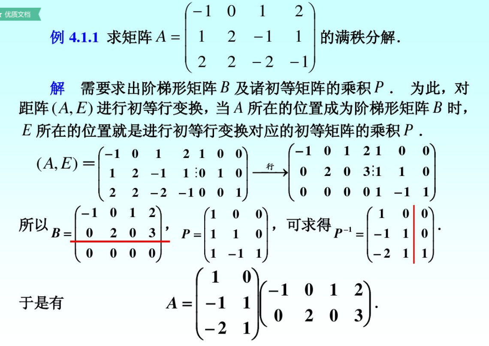
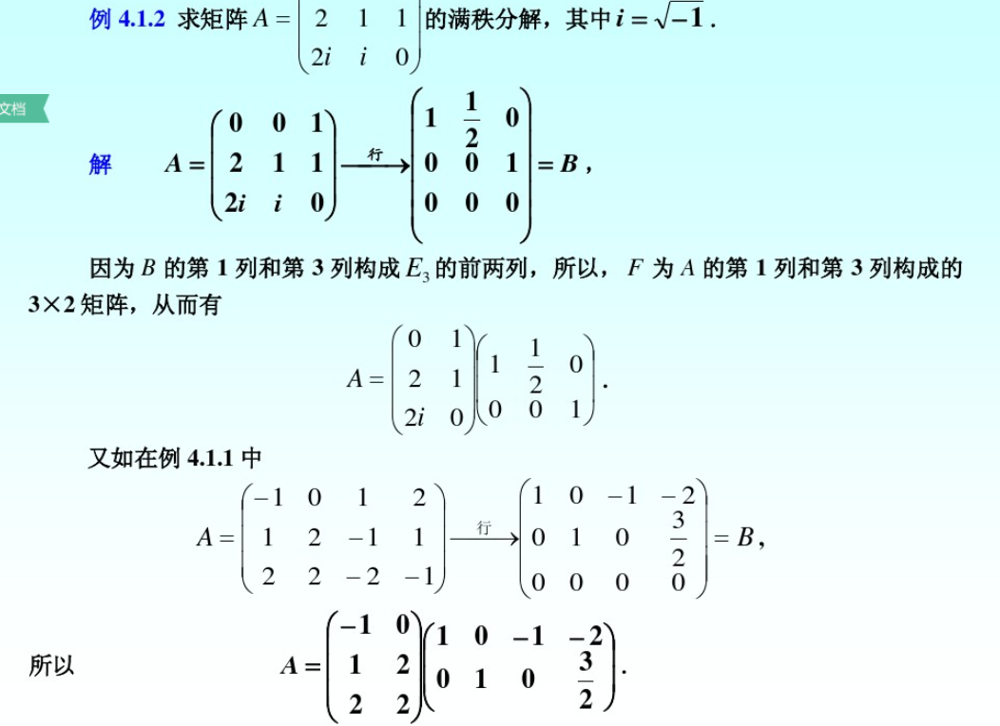

# 矩阵分解

## 矩阵的满秩分解

定义：设$A\in C^{m\times n},rank(A)=r$,如果存在列满秩矩阵$F\in C^{m\times n}$和行满秩矩阵$G\in C^{r\times n}$,使得
$$A=FG$$则称上式为矩阵A的满秩分解，当A是满秩（列满秩或行满秩）矩阵时，A可分解为一个单位阵和其本身，称此满秩分解为平凡分解。

定理：设非零阵$A\in C^{m\times n},rank(A)=r$,则A有满秩分解。

$proof.$
$rank(A)=r$时，对A进行初等行变换为行阶梯型矩阵B，即
$$A\xrightarrow{r}B=\begin{pmatrix}G\\O \end{pmatrix},\quad G\in C^{r\times n},\quad rank(G)=r$$
于是存在m阶可逆阵P，使得$PA=B$或者$A=P^{-1}B$.将$P^{-1}$分块为$P^{-1}=(F,S)$,其中
$F\in C^{m\times r},rank(F)=r,S\in C^{m\times(m-r)},rank(S)=m-r,$则有：
$$
A=P^{-1}B=(F,S)\begin{pmatrix}G\\O \end{pmatrix}=FG
$$
其中F是列满秩矩阵，G是行满秩矩阵

注1：矩阵A的满秩分解不唯一，因为如果取任一r阶非奇异阵，则式可改写为
$$
A=(FD)(D^{-1}G)=\tilde F\tilde G
$$
是A的另一个满秩分解。
注2：由证明过程可以用初等变换的方法求满秩分解。
注意列满秩阵是P逆的前r列,计算量较大

为了避免求逆，引入下面的定义

### 置换矩阵

定义：以n阶单位阵$E_n$的n个列向量$e_1,e_2,\cdots,e_n$为列打乱顺序构成的n阶矩阵
$$
P=(e_{j_1},e_{j_2},\cdots,e_{j_n})
$$称为置换矩阵，这里$j_1,j_2,\cdots,j_n$是1,2，…，n的一个全排列。
如：$P=(e_3,e_4,e_1,e_2)$是一个4阶置换矩阵。

置换矩阵有如下性质

1. P是正交阵
2. 对任意$A\in C^{m\times n}$,AP是将A的列按$j_1,j_2,\cdots,j_n$的次序重新排列得到的矩阵。
我们已知，任意非零秩r阵A，可以通过初等行变换化为行最简形，且B的前r行线性无关。

定理：设$A\in C^{m\times n},rank(A)=r(r\gt 0),$A的行最简形矩阵为B，那么在A的满秩分解中，可取F为A的$j_1,j_2,\cdots,j_r$列所构成的$m\times r$矩阵，G为B的前r行构成的$r\times n$矩阵。
下面确定列满秩矩阵F，参照A的行最简形矩阵B作n阶置换矩阵
$$
P_1=(e_{j_1},\cdots,e_{j_r},e_{j_{r+1}},\cdots,e_{j_n})
$$按列划分$A=(\alpha_1,\cdots,\alpha_n),\quad B=(\beta_1,\beta_2,\cdots,\beta_n)$有
$$
AP_1=(\alpha_{j_1},\cdots,\alpha_{j_r},\alpha_{j_{r+1}},\cdots,\alpha_{j_n})
$$ $$
BP_1=(\beta_{j_1},\cdots,\beta_{j_r},\beta_{j_{r+1}},\cdots,\beta_{j_n})=
\begin{pmatrix}
E_r & B_{12}\\
O & O
\end{pmatrix}
$$
其中$B_{12}\in C^{r\times (n-r)}$，再由$A=P^{-1}B,$可得
$$
AP_1=P^{-1}(BP_1)=(F,S)
\begin{pmatrix}
E_r & B_{12}\\
O & O
\end{pmatrix}=(F,FB_{12})
$$
即F为$AP_1$的前r列构成的矩阵，也就是A的$j_1,j_2,\cdots,j_r$列构成的矩阵。

利用上述定理求A的满秩分解时，需要首先求出A的行最简形矩阵B，但并未用到矩阵P，因此不需求。

## QR分解

(Schur定理)若$A\in C^{n\times n},$则存在酉矩阵，使得
$$
U^HAU=T
$$
其中T为上三角矩阵，T的主对角线上的元素都是A的特征值。

（QR分解定理）设A为n阶复矩阵，则存在酉矩阵Q及上三角矩阵R，使得
$$
A=QR
$$

## 正规矩阵

定义：设A为n阶复矩阵，若
$$
A^HA=AA^H
$$
则称A为正规矩阵
显然：对角阵、实对称矩阵($A=A^T$)、实反对称矩阵$(A^T=-A)$、正交矩阵$(A^{-1}=A^T)$、Hermite矩阵($A=A^H$),反Hermite矩阵($A^H=-A$),酉矩阵$(A^{-1}=A^H)$都是正规矩阵
注：正规矩阵并不只有上述这些。

## 矩阵的奇异值分解

引理：设$A\in C^{m\times n},$则：

1. $A^HA,AA^H$的特征值全为非负实数。
2. $A^HA,AA^H$的非零特征值相同，并且非零特征值的个数（重特征值按重数算）等于$rank(A)$
3. $rank(A^HA)=rank(AA^H)=rank(A)$

定义：设$A\in C^{m\times n},rank(A)=r(r\gt 0)$,矩阵$A^HA$的特征值为
$$
\lambda_1\ge \lambda_2\ge\cdots\ge\lambda_r\gt \lambda_{r+1}=\cdots=\lambda_n=0
$$则称$\sigma_i=\sqrt{\lambda_i}(i=1,2,\cdots,n)$为A的奇异值。
易见，A的奇异值的个数等于A的列数，A的非零奇异值的个数等于$rank(A)$

定理(奇异值分解)设$A\in\mathbb C^{m\times n}$，则存在m阶酉阵U和n阶酉阵V，使得
$$
A=USV^H=\sigma_1u_1v_1^H+\sigma_2u_2v_2^H+\cdots+\sigma_ru_rv_r^H
$$其中$S=diag(\sigma_1,\cdots,\sigma_n)\in\mathbb R^{m\times n},\sigma_i\gt 0(i=1,\cdots,r),r=rank(A)$

推论：在矩阵A的奇异值分解$A=USV^H$中，U的列向量为$AA^H$的特征向量，V的列向量为$A^HA$的特征向量。
$proof.$
$$
\begin{aligned}
\because AA^H=& (USV^H)(USV^H)^H\\
=& USV^HVS^HU^H=USS^HU^H\\
\therefore (AA^H)U=& USS^H=Udiag(\lambda_1,\lambda_2,\cdots,\lambda_r,0,\cdots,0)
\end{aligned}
$$记$U=(u_1,\cdots,u_m)$,则$(AA^H)u_i=\lambda_iu_i,i=1,\cdots,m$